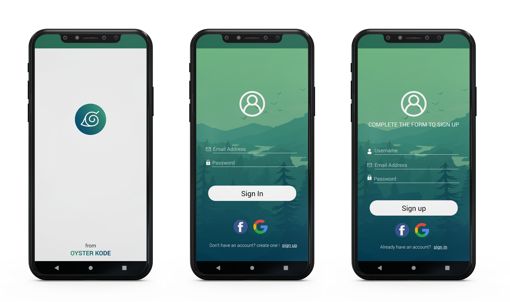
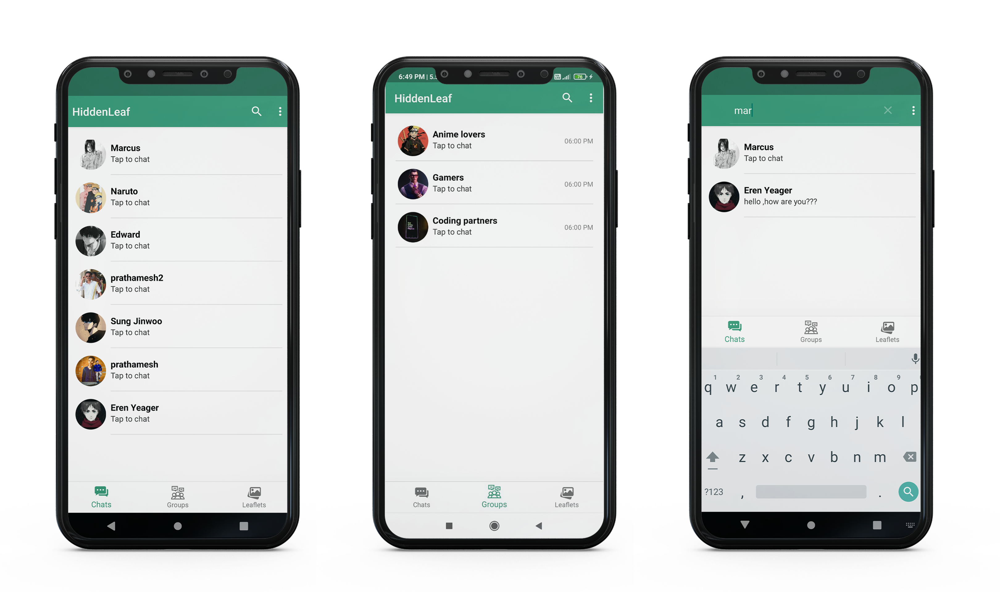
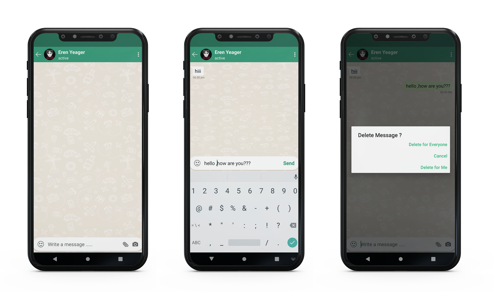
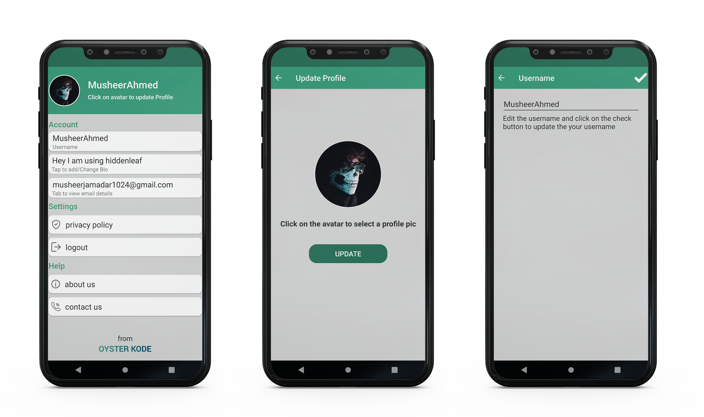
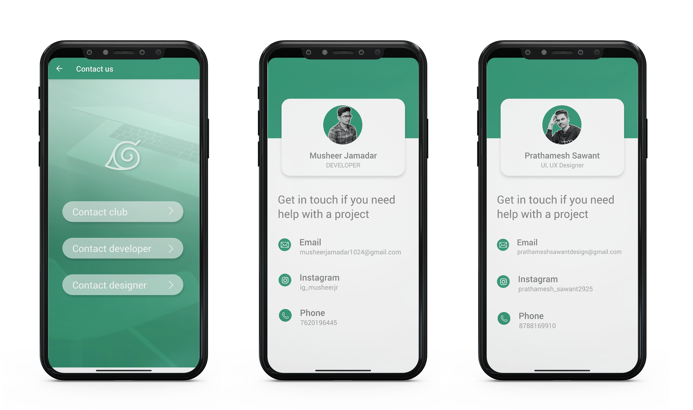

 
  

&#xa0;

  <!-- <a href="https://e_commerce_app_flutter.netlify.app">Demo</a> -->

<h1 align="center">HiddenLeaf App</h1>

## Status

<h4 align="center">
	Complete
</h4>

  <a href="#dart-about">About</a> &#xa0; | &#xa0; 
  <a href="#sparkles-features">Features</a> &#xa0; | &#xa0;
  <a href="#checkered_flag-illustrations">Illustrations</a> &#xa0; | &#xa0;
  <a href="https://github.com/MusheerJ" target="_blank">Author</a>

 

## :dart: About

This is a Private Messaging Application developed using AndroidFire(Android+Firebase). This Application  have advance features like any modern messaging application today
## :sparkles: Features

:heavy_check_mark: User friendly UI\
:heavy_check_mark: Create new users using email, gmail or facebook\
:heavy_check_mark: User Authentication\
:heavy_check_mark: Store user details and chats using modern encryption algorithm\
:heavy_check_mark: Private chats\
:heavy_check_mark: Group chats\
:heavy_check_mark: Update user profile, username, user status\
:heavy_check_mark: Clear chat history\
:heavy_check_mark: Delete messages from everyone\
:heavy_check_mark: User status active when user is online\
:heavy_check_mark: Search users using username or email\
:heavy_check_mark: And many more to come 

## :checkered_flag: Illustrations

Here are some Illustration of App Screens

|  |
| :--------------------------------:| 
|            Authentication         |

|  |
| :--------------------------------:| 
|            Chats         |

|  |
| :--------------------------------:| 
|            Personnal Chat         |

|  |
| :--------------------------------:| 
|            User Profile         |

|  |
| :--------------------------------:| 
|            Contact       |

